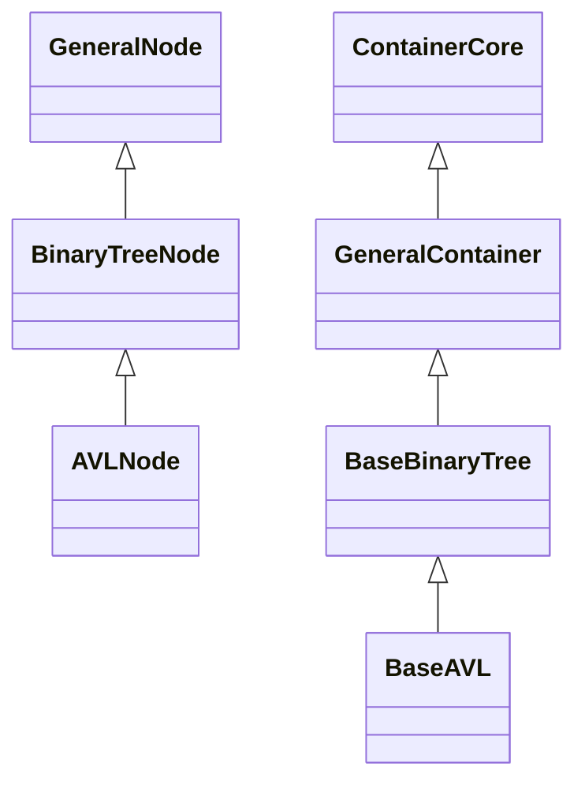
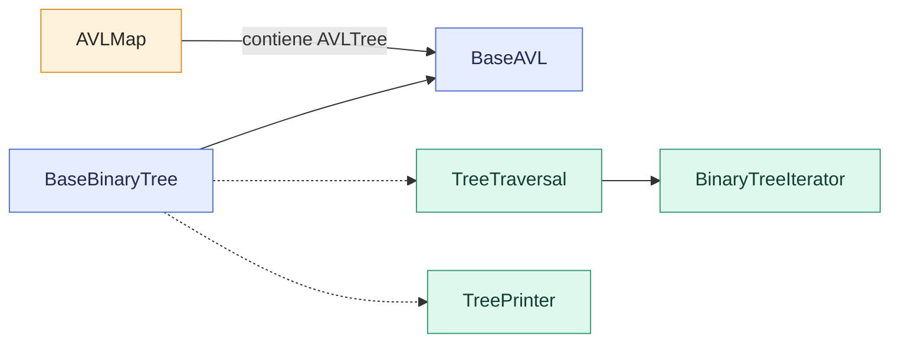

# 2026-II-CS-UNI-CC0E5-AEDAv

# Arquitectura de BinaryTree, AVLTree y AVLMap

## 1. Jerarquía de clases

```mermaid
classDiagram
    direction TB

    class GeneralNode
    class BinaryTreeNode
    class AVLNode

    class ContainerCore
    class GeneralContainer
    class BaseBinaryTree
    class BaseAVL

    GeneralNode <|-- BinaryTreeNode
    BinaryTreeNode <|-- AVLNode

    ContainerCore <|-- GeneralContainer
    GeneralContainer <|-- BaseBinaryTree
    BaseBinaryTree <|-- BaseAVL
```

## 2. Relación entre componentes

```mermaid
flowchart LR
    BT["BaseBinaryTree"]
    AVL["BaseAVL"]
    IT["BinaryTreeIterator"]
    TT["TreeTraversal"]
    PR["TreePrinter"]
    MAP["AVLMap"]

    BT --> AVL
    BT -.-> TT
    TT --> IT
    BT -.-> PR
    MAP -->|"contiene AVLTree"| AVL

    classDef tree fill:#e6edff,stroke:#5572cf,color:#202a50
    classDef support fill:#dff8ee,stroke:#3b9b79,color:#123d31
    classDef map fill:#fff2dc,stroke:#d99526,color:#292524

    class BT,AVL tree
    class IT,TT,PR support
    class MAP map
```
